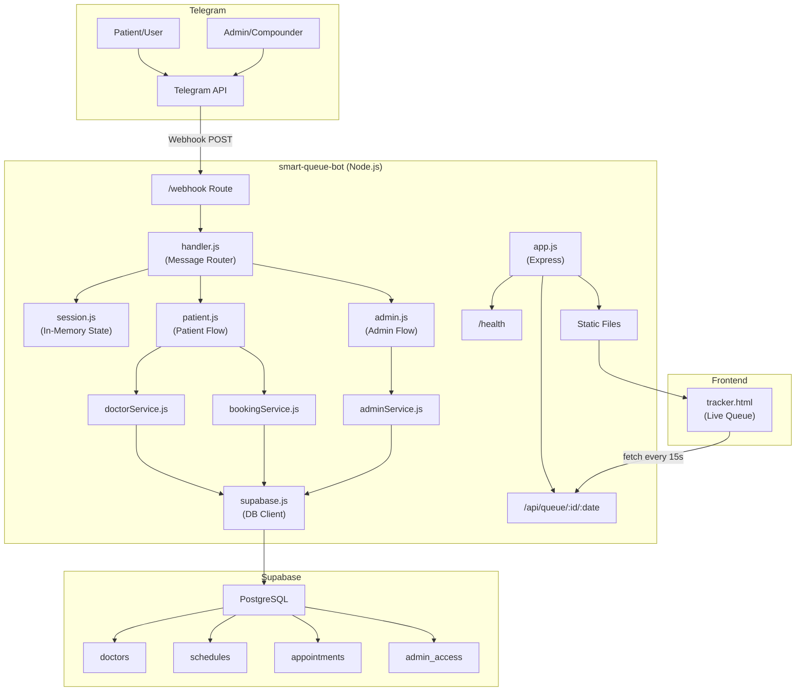
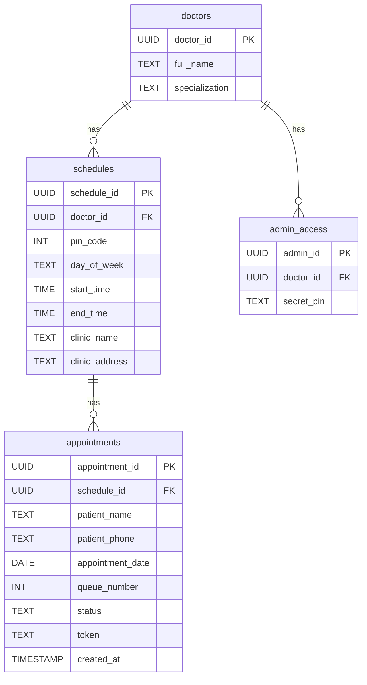
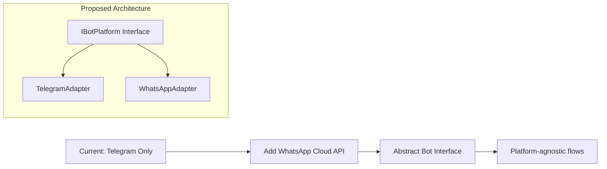
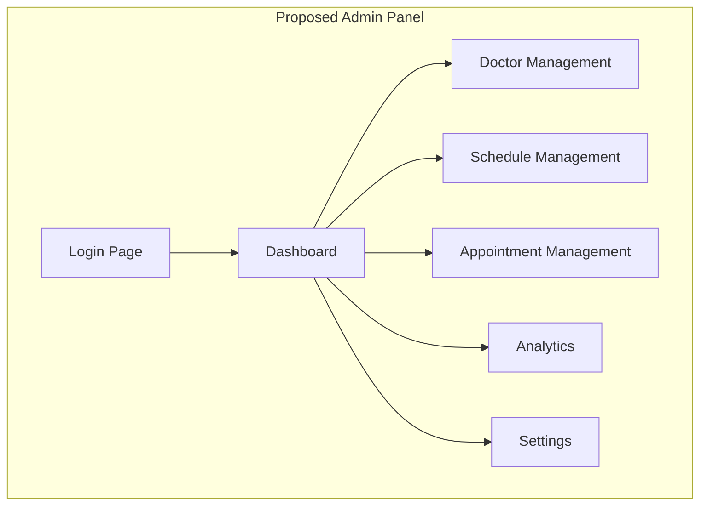
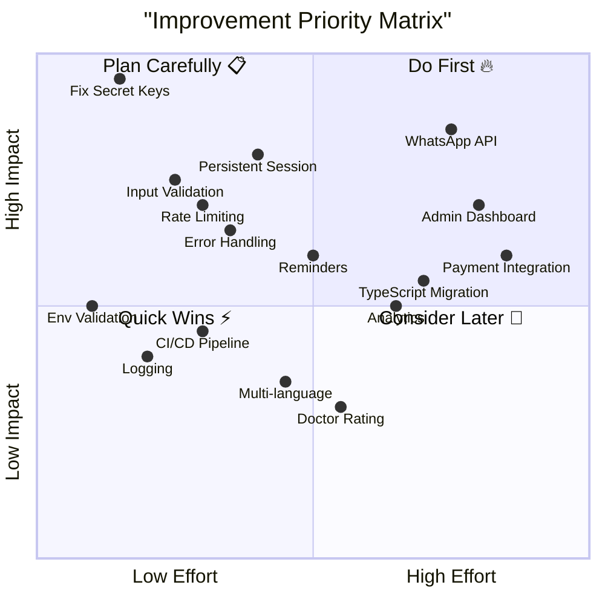

# 🏥 Dr_Booking (Smart Queue Bot) — সম্পূর্ণ Project Analysis ও Improvement Plan

> **Repository:** [tazla25/Dr_Booking](https://github.com/tazla25/Dr_Booking)
> **Analysis Date:** 30 July 2026

---

## 📋 সারসংক্ষেপ (Executive Summary)

এটি একটি **Telegram Bot-based Doctor Appointment & Live Queue Management System** যা local clinic গুলোর জন্য তৈরি করা হয়েছে। Micro-SaaS concept — patient দের কোনো app download করতে হয় না। Bot এর মাধ্যমে PIN code দিয়ে doctor খুঁজে appointment book করা যায় এবং compounder/admin রা patient queue manage করতে পারে।

**Tech Stack:**
| Component | Technology |
|-----------|-----------|
| Runtime | Node.js |
| Bot Framework | node-telegram-bot-api |
| Web Server | Express.js |
| Database | Supabase (PostgreSQL) |
| Frontend | Vanilla HTML/CSS/JS (tracker page) |
| Testing | Jest |
| Deployment Target | Render.com |

---

## 🏗️ বর্তমান Architecture



### Directory Structure
```
smart-queue-bot/
├── src/
│   ├── bot/
│   │   ├── index.js        ← Telegram bot init & webhook
│   │   ├── handler.js       ← Message routing to flows
│   │   └── session.js       ← In-memory session state machine
│   ├── flows/
│   │   ├── patient.js       ← Patient booking conversation
│   │   └── admin.js         ← Admin/compounder flow
│   ├── services/
│   │   ├── doctorService.js ← Doctor search by PIN
│   │   ├── bookingService.js← Booking creation & queue status
│   │   └── adminService.js  ← Admin auth & patient management
│   ├── database/
│   │   └── supabase.js      ← Supabase client singleton
│   ├── utils/
│   │   └── messages.js      ← Bengali UI strings (i18n-ready)
│   └── app.js               ← Express app setup
├── public/
│   └── tracker.html         ← Live queue tracker page
├── tests/
│   ├── services/            ← Service unit tests
│   └── flows/               ← Flow unit tests
├── schema.sql               ← Database DDL
├── .env.example             ← Environment variables template
├── index.js                 ← Entry point
└── package.json
```

### Database Schema


---

## ✅ ভালো দিকগুলো (Strengths)

### 1. 🎯 Clean Architecture
- **Separation of Concerns** ভালো করা হয়েছে — `bot/`, `flows/`, `services/`, `database/`, `utils/` আলাদা
- Single Responsibility Principle follow করা হয়েছে মোটামুটি
- Handler → Flow → Service → Database chain পরিষ্কার

### 2. 🇧🇩 Bengali (বাংলা) Localization
- সব user-facing message বাংলায় আছে
- `messages.js` এ সব string centralized
- i18n-ready structure

### 3. 📱 Zero-App Concept
- Patient দের কোনো app install করতে হয় না — smart idea
- Telegram দিয়ে সব হচ্ছে

### 4. 🧪 Test Coverage
- Jest tests আছে services এবং flows দুটোরই জন্য
- Unit test structure ভালো

### 5. 🌐 Live Queue Tracker
- `tracker.html` — auto-refresh every 15s
- Simple, clean UI with gradient background

### 6. 📝 Good Documentation
- README.md বিস্তারিত — setup steps, deploy instructions সব আছে
- Schema.sql ভালো commented

---

## 🔴 Critical Issues (এখনই ঠিক করা দরকার)

### 1. 🚨 SECRET KEYS EXPOSED IN `.env.example`!

> [!CAUTION]
> `.env.example` ফাইলে **আসল (real) Supabase URL, Anon Key, এবং Telegram Bot Token** পুশ করা হয়েছে! এটা একটা **গুরুতর security vulnerability**।

```
# .env.example এ যা আছে (REAL credentials!):
SUPABASE_URL=https://fepuihmkijvwmjpiqzfz.supabase.co
SUPABASE_ANON_KEY=sb_publishable_Y_6AP75dU9mC27qhOzD4AA_cz5wsRir
TELEGRAM_BOT_TOKEN=8370309929:AAE3PjHQLBF_ztOPoSVqqsjBCMSsKtyULsQ
```

**সমাধান:**
1. **এখনই** Supabase key rotate করো
2. **এখনই** Telegram bot token revoke করে নতুন token নাও
3. `.env.example` এ placeholder রাখো:
```env
SUPABASE_URL=https://your-project-id.supabase.co
SUPABASE_ANON_KEY=your-anon-key-here
TELEGRAM_BOT_TOKEN=your-telegram-bot-token
PORT=3000
PUBLIC_URL=https://your-app.onrender.com
```

### 2. 💾 In-Memory Session = Data Loss

> [!WARNING]
> `session.js` সব session data RAM-এ রাখে। Server restart হলে সব user এর conversation state হারিয়ে যাবে। Production-এ এটা বড় সমস্যা।

**সমাধান:**
- Redis বা Supabase-তে session persist করো
- মিনিমাম: `Map` এর পরিবর্তে Supabase `sessions` table ব্যবহার করো

### 3. 🔓 Admin Auth খুবই দুর্বল

- মাত্র 4-digit PIN দিয়ে admin login হচ্ছে
- Brute-force attack এ সেকেন্ডে ভাঙবে (10,000 combinations)
- কোনো rate limiting নেই
- কোনো login attempt tracking নেই

### 4. ⚡ Race Condition in Queue Number Generation

```javascript
// bookingService.js — current approach:
const { count } = await supabase
  .from('appointments')
  .select('*', { count: 'exact', head: true })
  .eq('schedule_id', scheduleId)
  .eq('appointment_date', appointmentDate);

const queueNumber = (count || 0) + 1;
```

দুজন patient একই সাথে book করলে **একই queue number** পেতে পারে! 

**সমাধান:** PostgreSQL sequence বা `SERIALIZABLE` transaction ব্যবহার করো।

---

## 🟡 Major Improvements (Priority High)

### 5. Error Handling অপর্যাপ্ত

| Issue | Details |
|-------|---------|
| Generic error messages | সব error এ একই message দেখায় |
| No error logging service | শুধু `console.error` ব্যবহার হচ্ছে |
| Supabase errors silently fail | কোনো retry logic নেই |
| No graceful shutdown | Process kill হলে webhook hung হয়ে যায় |

**সমাধান:**
```javascript
// Structured error handling example
class AppointmentError extends Error {
  constructor(message, code, userMessage) {
    super(message);
    this.code = code;
    this.userMessage = userMessage;
  }
}

// Graceful shutdown
process.on('SIGTERM', async () => {
  console.log('Shutting down gracefully...');
  await bot.close();
  server.close();
  process.exit(0);
});
```

### 6. Input Validation নেই

- Patient phone number validation নেই
- Date format validation weak
- Admin PIN sanitization নেই
- SQL injection risk (Supabase ORM দিয়ে কিছুটা safe, তবুও)

### 7. No Rate Limiting

- Bot spam attack এর কোনো protection নেই
- API endpoints open — যে কেউ hit করতে পারে

### 8. Booking Cancellation ব্যবস্থা অসম্পূর্ণ

- `/cancel <token>` command mention আছে README-তে, কিন্তু implementation দেখা যায়নি handler.js-এ
- No cancellation confirmation flow

---

## 🟢 Feature Improvements (Priority Medium-High)

### 9. 📱 WhatsApp Integration

README-তে "Phase 2" তে mention আছে। Implementation plan:



```javascript
// Proposed: Platform adapter pattern
class BotPlatform {
  async sendMessage(chatId, text, options) { throw new Error('Not implemented'); }
  async setWebhook(url) { throw new Error('Not implemented'); }
}

class TelegramPlatform extends BotPlatform {
  // Telegram-specific implementation
}

class WhatsAppPlatform extends BotPlatform {
  // WhatsApp Cloud API implementation
}
```

### 10. 🔔 Appointment Reminders

- Appointment এর ১ ঘণ্টা আগে notification পাঠানো
- Queue position update real-time

```javascript
// cron-based reminder system
const cron = require('node-cron');

cron.schedule('*/10 * * * *', async () => {
  const upcomingAppointments = await getUpcomingAppointments(60); // 60 min
  for (const apt of upcomingAppointments) {
    await bot.sendMessage(apt.chatId, 
      `⏰ রিমাইন্ডার: আপনার অ্যাপয়েন্টমেন্ট ১ ঘণ্টার মধ্যে।\nটোকেন: ${apt.token}`
    );
  }
});
```

### 11. 📊 Analytics Dashboard

Currently কোনো analytics নেই। Add করা উচিত:

| Metric | Description |
|--------|-------------|
| Daily appointments | দৈনিক booking সংখ্যা |
| Average wait time | গড় অপেক্ষার সময় |
| Peak hours | সবচেয়ে busy সময় |
| No-show rate | যারা আসেননি তাদের হার |
| Doctor utilization | প্রতিটি doctor এর patient load |

### 12. 🎨 Tracker Page Improvement

বর্তমান tracker.html basic। Improvement করা উচিত:

- **Dark mode** support
- **Sound notification** যখন token change হবে
- **Estimated wait time** দেখানো
- **Mobile-first responsive** design
- **PWA** (Progressive Web App) বানানো যাতে home screen এ add করা যায়

---

## 🔧 Technical Debt ও Code Quality

### 13. TypeScript Migration

> [!TIP]
> JavaScript থেকে TypeScript-এ migrate করলে অনেক bug compile-time এই ধরা পড়বে।

```typescript
// Type-safe session management
interface PatientSession {
  step: 'AWAITING_PIN' | 'AWAITING_DOCTOR_SELECTION' | 'AWAITING_DATE' | 'AWAITING_NAME';
  pinCode?: number;
  schedules?: Schedule[];
  selectedSchedule?: Schedule;
}

interface AdminSession {
  step: 'ADMIN_AWAITING_PIN' | 'ADMIN_DASHBOARD';
  adminDoctorId?: string;
  currentScheduleId?: string;
}

type Session = PatientSession | AdminSession | { step: 'IDLE' };
```

### 14. Environment Variable Validation

```javascript
// startup এ validate করো
const requiredEnvVars = ['SUPABASE_URL', 'SUPABASE_ANON_KEY', 'TELEGRAM_BOT_TOKEN'];
for (const envVar of requiredEnvVars) {
  if (!process.env[envVar]) {
    console.error(`❌ Missing required env var: ${envVar}`);
    process.exit(1);
  }
}
```

### 15. Logging Improvement

```javascript
// winston বা pino ব্যবহার করো
const pino = require('pino');
const logger = pino({
  level: process.env.LOG_LEVEL || 'info',
  transport: {
    target: 'pino-pretty',
    options: { colorize: true }
  }
});

// Usage
logger.info({ chatId, action: 'booking_created', token }, 'New booking');
logger.error({ chatId, error: err.message }, 'Booking failed');
```

### 16. CI/CD Pipeline

কোনো CI/CD setup নেই। GitHub Actions add করো:

```yaml
# .github/workflows/ci.yml
name: CI
on: [push, pull_request]
jobs:
  test:
    runs-on: ubuntu-latest
    steps:
      - uses: actions/checkout@v4
      - uses: actions/setup-node@v4
        with:
          node-version: '20'
      - run: npm ci
      - run: npm test
      - run: npm run lint
```

---

## 🚀 Advanced Feature Proposals

### 17. Multi-Doctor Dashboard (Web Panel)



- React/Next.js admin dashboard
- Doctor onboarding self-service
- Schedule management UI
- Real-time appointment monitoring

### 18. Payment Integration

- Online payment option (bKash, Nagad, Rocket)
- Consultation fee advance payment
- Refund for cancellation

### 19. Multi-language Support

`messages.js` already i18n-ready structure আছে। Expand করো:

```javascript
// i18n implementation
const messages = {
  bn: { /* Bengali messages - already exists */ },
  en: { /* English messages */ },
  hi: { /* Hindi messages */ },
};

function getMessage(key, lang = 'bn') {
  return messages[lang][key] || messages['bn'][key];
}
```

### 20. Doctor Rating ও Review System

- Appointment শেষে patient rating দিতে পারবে
- Doctor profile এ rating দেখাবে

---

## 📊 Improvement Priority Matrix



---

## 🗓️ Recommended Implementation Roadmap

### Phase 0 — Critical Fixes (এই সপ্তাহে)
- [x] 🔴 Secret keys rotate করো ও `.env.example` fix করো
- [x] 🔴 Race condition fix করো (queue number generation)
- [x] 🟡 Basic input validation add করো
- [x] 🟡 Environment variable validation add করো

### Phase 1 — Stability (1-2 সপ্তাহ)
- [ ] Session persistence (Redis বা Supabase)
- [ ] Proper error handling ও logging
- [x] Rate limiting add করো
- [ ] Admin auth strengthen করো (OTP/stronger PIN)
- [x] `/cancel` command implement করো
- [x] CI/CD pipeline setup

### Phase 2 — Feature Expansion (3-4 সপ্তাহ)
- [ ] Appointment reminders (cron-based)
- [ ] Tracker page redesign (PWA, dark mode, sound)
- [ ] WhatsApp Cloud API integration
- [ ] Bot platform abstraction layer
- [ ] Booking cancellation ও reschedule

### Phase 3 — Scale (1-2 মাস)
- [ ] Admin web dashboard (React/Next.js)
- [ ] Analytics ও reporting
- [ ] Multi-language support
- [ ] TypeScript migration
- [ ] Payment integration (bKash/Nagad)

### Phase 4 — Premium Features (2-3 মাস)
- [ ] AI-predicted wait time
- [ ] Doctor rating system
- [ ] Digital PDF invoices
- [ ] Multi-clinic support
- [ ] Walk-in patient management

---

## 📈 Overall Score

| Category | Score | Notes |
|----------|-------|-------|
| **Architecture** | ⭐⭐⭐⭐ (4/5) | Clean separation, good structure |
| **Security** | ⭐ (1/5) | Exposed secrets, weak auth, no rate limiting |
| **Code Quality** | ⭐⭐⭐ (3/5) | Decent but needs TypeScript, better error handling |
| **Testing** | ⭐⭐⭐ (3/5) | Tests exist but coverage unknown, no integration tests |
| **Documentation** | ⭐⭐⭐⭐ (4/5) | Good README, schema documented |
| **Scalability** | ⭐⭐ (2/5) | In-memory sessions, no caching, single process |
| **UX/UI** | ⭐⭐⭐ (3/5) | Bengali UX good, tracker page basic |
| **DevOps** | ⭐ (1/5) | No CI/CD, no monitoring, no health alerts |
| **Overall** | ⭐⭐⭐ (2.75/5) | ভালো শুরু, কিন্তু production-ready হতে অনেক কাজ বাকি |

---

> [!IMPORTANT]
> এই project টা concept হিসেবে চমৎকার — local clinic গুলোর জন্য zero-download queue system একটা real problem solve করে। কিন্তু **production-এ deploy করার আগে** অবশ্যই Phase 0 ও Phase 1 এর সব কাজ শেষ করতে হবে, বিশেষ করে **security fixes**।
